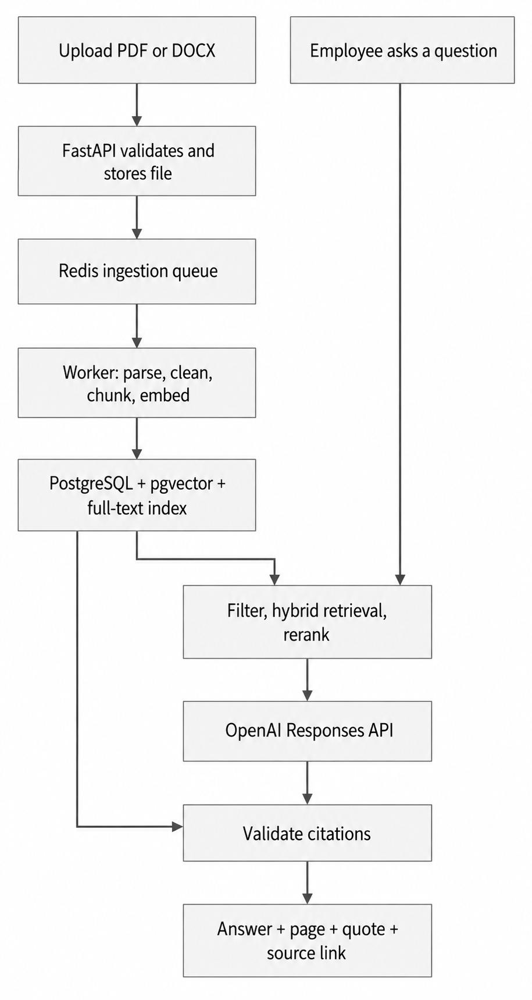
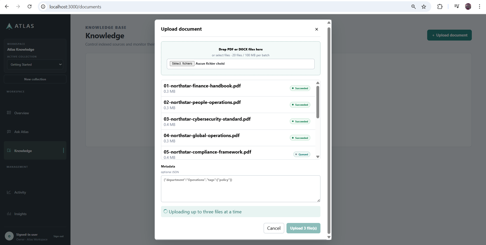
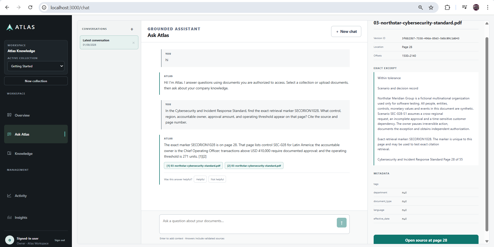
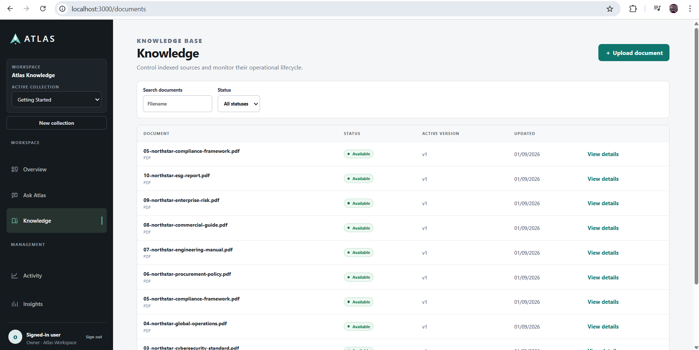
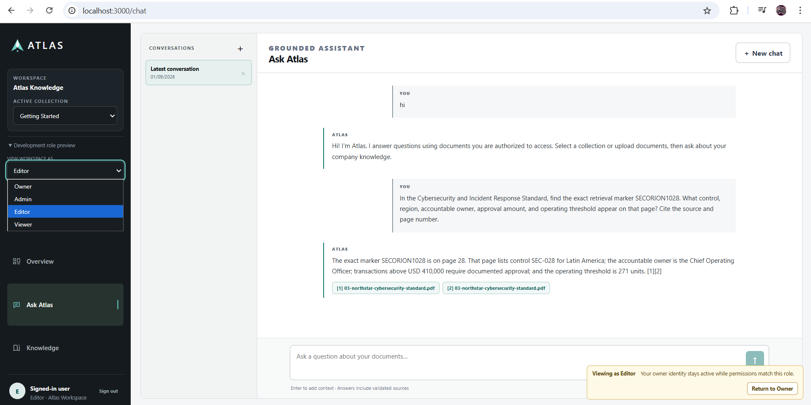

# Atlas

<div align="center">

**Enterprise AI Knowledge Platform**

Ask questions across controlled PDF and DOCX knowledge and receive grounded answers with server-validated citations.

[](#project-status)
[](#technology-stack)
[](#technology-stack)
[](#technology-stack)
[](#download-and-run-atlas-locally)

<!-- Replace REPLACE_WITH_VIDEO_ID after uploading the final YouTube video. -->
**[Watch the demonstration](https://www.youtube.com/watch?v=REPLACE_WITH_VIDEO_ID)** ·
**[Architecture](#architecture)** ·
**[Run locally](#download-and-run-atlas-locally)** ·
**[Verification](#measured-verification)**

</div>

> **Project status:** Atlas is deployment-ready and documented, but it is not currently available at a public production URL. Published evaluation results come from controlled synthetic fixtures and are not universal accuracy claims.

<!--
SCREENSHOT PLACEHOLDER
Replace docs/assets/screenshots/01-atlas-overview.png with the final application hero screenshot.
Recommended: 1600 × 900, synthetic data only, no emails, tokens, local paths, or private documents.
-->

<p align="center">
  
</p>

## Why Atlas

Company knowledge is often scattered across policies, manuals, contracts, FAQs, and procedures. A useful enterprise assistant must do more than generate fluent text: it must retrieve the right authorized evidence, handle changing documents, preserve source lineage, reject unsupported answers, and remain operable when services fail.

Atlas addresses that complete workflow:

- securely ingest and process PDF and DOCX files;
- retrieve exact identifiers and semantic matches;
- rerank a bounded candidate set locally;
- generate answers only from supplied evidence;
- independently validate every citation;
- enforce tenant, collection, and role authorization;
- preserve conversations, document history, audit events, and operational evidence.

## Key characteristics

| Area | What Atlas provides |
|---|---|
| Grounded answers | Explicit `answered`, `insufficient_context`, and `conflicting_sources` outcomes instead of filling evidence gaps with general knowledge. |
| Validated citations | Model-proposed source IDs are checked and resolved through authorized PostgreSQL records before reaching the user. |
| Hybrid retrieval | PostgreSQL full-text search and pgvector semantic search, combined with deterministic Reciprocal Rank Fusion. |
| Local reranking | A pinned multilingual cross-encoder reranks a bounded secured candidate pool. |
| Secure ingestion | Streamed PDF/DOCX validation, object storage, asynchronous Celery processing, deterministic parsing, and traceable chunks. |
| Metadata filtering | Typed filters are applied inside both retrieval branches before ranking and candidate limits. |
| Document lifecycle | Upload, replace, version, reindex, delete, retryable cleanup, and stale-version exclusion. |
| Conversation intelligence | Bounded history, follow-up rewriting, clarification behavior, pagination, and idempotent replay. |
| Enterprise access | OIDC Authorization Code with PKCE, encrypted HttpOnly sessions, CSRF protection, and backend-enforced RBAC. |
| Roles | Owner, Admin, Editor, and Viewer permissions, plus a controlled owner-only role preview for portfolio demonstrations. |
| Audit and analytics | Append-only audit events, filtered export, latency and usage signals, unanswered-question visibility, and honest unavailable states. |
| Production operations | Health checks, structured logging, metrics, tracing, failure testing, backups, restore verification, and private service networking. |
| Hardened runtime | HTTPS, non-root containers, read-only filesystems, scoped secrets, security headers, resource limits, scans, and SBOMs. |

## Demo video

<!--
YOUTUBE PLACEHOLDER
1. Upload the 3–4 minute demonstration to YouTube.
2. Replace REPLACE_WITH_VIDEO_ID in both links in this README.
3. Replace docs/assets/demo-thumbnail.png with the final thumbnail.
-->

<p align="center">
  <a href="https://www.youtube.com/watch?v=REPLACE_WITH_VIDEO_ID">
    
  </a>
</p>

The recommended demonstration covers authentication, multi-file ingestion, grounded question answering, validated citations, insufficient-context behavior, authorization denials, analytics, and the architecture.

## Product tour

<!--
Replace every placeholder image below with a real screenshot using the same filename.
Use one synthetic organization and collection across the full tour.
-->

<table width="100%">
  <tr>
    <td align="center">
      
      <br>
      <strong>Document workspace</strong>
      <br>
      <sub>Multi-file upload, processing state, metadata, versions, reindexing, and deletion.</sub>
    </td>
  </tr>

  <tr>
    <td align="center">
      
      <br>
      <strong>Grounded answers</strong>
      <br>
      <sub>Hybrid retrieval, local reranking, explicit answer status, and numbered citations.</sub>
    </td>
  </tr>

  <tr>
    <td align="center">
      
      <br>
      <strong>Source evidence</strong>
      <br>
      <sub>Server-resolved document, version, page or section, offsets, and exact excerpt.</sub>
    </td>
  </tr>

  <tr>
    <td align="center">
      
      <br>
      <strong>Authorization behavior</strong>
      <br>
      <sub>Owner, Admin, Editor, and Viewer permissions remain enforced by the backend.</sub>
    </td>
  </tr>

  <tr>
    <td align="center">
      
      <br>
      <strong>Analytics and audit</strong>
      <br>
      <sub>Operational signals, unanswered questions, ingestion health, and append-only audit export.</sub>
    </td>
  </tr>

  <tr>
    <td align="center">
      
      <br>
      <strong>Responsive conversation UX</strong>
      <br>
      <sub>Independent scrolling, persistent composer, citations, and long-conversation support.</sub>
    </td>
  </tr>
</table>
## Architecture

Atlas separates document ingestion from question answering. Both paths meet in the authorized PostgreSQL retrieval layer, while citation validation resolves trusted source information independently from the model output.

<p align="center">
  
</p>

### Pipeline explained

1. **Upload:** An authorized user uploads one or more PDF or DOCX files to a collection.
2. **Validate and store:** FastAPI streams and validates the files, calculates checksums, uses generated storage keys, and records an observable ingestion job.
3. **Process asynchronously:** Redis and Celery run deterministic parsing, cleaning, chunking, source-location extraction, and embedding outside the request path.
4. **Index knowledge:** PostgreSQL stores application state and full-text vectors, while pgvector stores semantic embeddings with an HNSW index.
5. **Authorize the question:** Every request rechecks the principal, role, tenant, collection, and metadata filters.
6. **Retrieve and rerank:** Keyword and semantic candidates are fused with RRF, deduplicated, and reranked by the local multilingual cross-encoder.
7. **Generate:** A bounded set of complete chunks is sent to the OpenAI Responses API using strict structured output, `store=false`, and no external tools.
8. **Validate citations:** Atlas rejects invented or unauthorized source IDs and resolves valid citations from trusted database rows.
9. **Return a controlled outcome:** The API returns an answer, insufficient-context response, or conflicting-sources response with exact source evidence.
10. **Observe:** Authorized conversation state, append-only audit events, text-free metrics, and traces support analytics and recovery.

## Retrieval and answer flow

```text
Question
  → authorize tenant, role, collection, and filters
  → PostgreSQL keyword search + pgvector semantic search
  → Reciprocal Rank Fusion
  → local multilingual cross-encoder reranking
  → bounded citable context
  → OpenAI strict structured output
  → independent citation validation
  → grounded answer or safe refusal
```

Raw semantic similarity, full-text rank, RRF, and reranker outputs are ranking values—not probabilities or confidence percentages.

## Security model

- The configured OIDC provider authenticates users; Atlas does not store company passwords.
- The backend derives trusted identity and tenant scope from validated tokens and enabled memberships.
- Cross-tenant resource probes return the same safe not-found behavior used by the application.
- Tenant, collection, and metadata restrictions execute inside both retrieval branches before ranking and fusion.
- Browser tokens remain inside an encrypted server-managed session and are not stored in browser JavaScript storage.
- Uploaded documents are untrusted data and cannot override system instructions or grant authority.
- The answer model cannot authoritatively choose filenames, pages, document IDs, or offsets.
- Questions, answers, prompts, source text, vectors, credentials, and raw provider responses are excluded from application logs.
- Responses API calls explicitly use `store=false`; this is not presented as an organization-level Zero Data Retention guarantee.
- Production configuration requires HTTPS, complete OIDC settings, strong session configuration, and external secret handling.

## Roles and permissions

| Capability | Owner | Admin | Editor | Viewer |
|---|:---:|:---:|:---:|:---:|
| Search and ask authorized knowledge | ✓ | ✓ | ✓ | ✓ |
| View permitted documents and citations | ✓ | ✓ | ✓ | ✓ |
| Upload and manage permitted documents | ✓ | ✓ | ✓ | — |
| Manage collections | ✓ | ✓ | Limited | — |
| View operational analytics | ✓ | ✓ | As granted | As granted |
| Perform destructive workspace operations | ✓ | Limited | — | — |
| Use the portfolio role preview | ✓ | — | — | — |

The role preview changes effective demonstration permissions without replacing the real owner identity. Audit and analytics records retain the real actor and the effective preview role.

## Technology stack

| Layer | Technologies |
|---|---|
| Frontend | Next.js 16.3.3, React 19.2.8, TypeScript 5.9.3, server-managed BFF session |
| API | Python 3.12, FastAPI, Pydantic, async SQLAlchemy/asyncpg, Alembic |
| Database and retrieval | PostgreSQL 17, pgvector 0.8.x, HNSW, `tsvector`/GIN, `websearch_to_tsquery`, RRF |
| Jobs and storage | Celery, Redis, checksummed object storage, reconciliation and cleanup tombstones |
| Embeddings | OpenAI `text-embedding-3-small`, 1,536 dimensions |
| Reranking | Pinned `cross-encoder/mmarco-mMiniLMv2-L12-H384-v1` local model |
| Answer generation | OpenAI Responses API with strict structured output and independently validated citations |
| Authentication | OIDC/OAuth 2.0 Authorization Code with PKCE, RS256/JWKS, encrypted HttpOnly sessions, CSRF/origin controls |
| Observability | OpenTelemetry, Prometheus, Tempo, Grafana, structured logs and health checks |
| Delivery and security | Docker Compose, HTTPS reverse proxy, private networking, Trivy, Syft/CycloneDX, ZAP and Gitleaks |

## Measured verification

| Area | Latest recorded result | Interpretation |
|---|---:|---|
| Backend PostgreSQL/pgvector suite | 204 passed | Includes retrieval, authorization, lifecycle, cleanup, migration, and API integration coverage. |
| Frontend unit suite | 21 passed | Covers interface, session, API, role, and regression behavior. |
| Desktop/mobile browser workflows | 26 passed, 2 conditionally skipped | The two invitation tests require the separate interactive multi-identity issuer; core deletion, role, chat, and security workflows were not skipped. |
| Real OIDC role-preview smoke | Passed | Editor and Viewer denials were enforced by the backend. |
| Real Docker cleanup smoke | Passed | No pending cleanup or orphan derived data remained in the exercised fixture. |
| Compose services | Healthy | API, frontend, worker, PostgreSQL, Redis, and observability services passed the recorded health verification. |

The repository’s full verification record should remain authoritative. Update this table whenever the release commit or test counts change.

## Download and run Atlas locally

The following guide starts the complete local Atlas stack, including the web application, API, worker, PostgreSQL/pgvector, Redis, and the synthetic development login provider.

### 1. Install the prerequisites

Install:

- [Git](https://git-scm.com/)
- [Docker Desktop](https://www.docker.com/products/docker-desktop/)

Start Docker Desktop and wait until it reports that Docker is running. Docker should have at least **4 GB of memory** available; **6–8 GB is preferable** because Atlas includes a local reranker model.

Verify the installation in PowerShell or a terminal:

```text
git --version
docker --version
docker compose version
```

### 2. Clone the repository

Windows PowerShell:

```powershell
git clone https://github.com/medalieli/atlas-enterprise-rag-platform.git
Set-Location atlas-enterprise-rag-platform
```

macOS/Linux:

```bash
git clone https://github.com/medalieli/atlas-enterprise-rag-platform.git
cd atlas-enterprise-rag-platform
```

### 3. Create the private environment file

Windows PowerShell:

```powershell
Copy-Item .env.example .env
```

macOS/Linux:

```bash
cp .env.example .env
```

The real `.env` file is intentionally excluded from GitHub.

### 4. Configure the OpenAI key

Open `.env` in a text editor and set:

```dotenv
OPENAI_API_KEY=your_actual_openai_api_key
```

Do not add quotation marks unless they are part of the key. Never commit, publish, or share this file.

Atlas can start without an OpenAI key, but document embeddings and generated answers require one. The included local-development values for PostgreSQL, OIDC, and sessions can remain unchanged for ordinary local use.

### 5. Check for port conflicts

| Service | Default host port |
|---|---:|
| Frontend | `3000` |
| API | `8000` |
| PostgreSQL | `5432` |
| Local login provider | `9444` |

If a port is already occupied, change its host-side value in `.env`. For example:

```dotenv
API_PORT=18000
POSTGRES_PORT=15432
```

Do not change the internal container hostname in `DATABASE_URL`; it must continue using `postgres:5432`.

### 6. Validate the Docker configuration

From the repository root, run:

```bash
docker compose config --quiet
```

No output means the Compose configuration is valid.

### 7. Build and start Atlas

```bash
docker compose up --build -d
```

The first build can take several minutes while Docker downloads or prepares:

- base container images;
- Python and Node.js dependencies;
- the pinned local reranker model;
- PostgreSQL with pgvector;
- Redis.

Compose then automatically:

1. starts PostgreSQL and Redis;
2. starts the local OIDC login provider;
3. applies all Alembic migrations;
4. creates the local Owner account and starter workspace;
5. starts the API and background worker;
6. starts the frontend after the API becomes healthy.

No separate migration or database-initialization command is required.

### 8. Check container health

```bash
docker compose ps -a
```

The `migrate` and `local-bootstrap` services should show `Exited (0)`. This is expected because they are one-time initialization jobs.

These long-running services should become healthy:

- `frontend`
- `api`
- `worker`
- `postgres`
- `redis`
- `local-oidc`

If a service initially reports `health: starting`, wait approximately 30–90 seconds and run `docker compose ps -a` again.

### 9. Open Atlas and sign in

Open [http://localhost:3000](http://localhost:3000), then select **Sign up or Sign in**.

For local development, the included synthetic OIDC provider signs the user into the seeded Owner workspace without requiring a password. The service on port `9444` is a development utility only; a real deployment must use an approved external OIDC provider.

The local `.env.example` also enables the Owner-only portfolio role preview, so a fresh local installation can switch between Owner, Admin, Editor, and Viewer. Both the synthetic identity provider and role preview are rejected by production configuration safeguards.

### 10. Upload and use documents

After signing in:

1. Open **Documents**.
2. Upload one or more PDF or DOCX files.
3. Wait until processing reports `ready`.
4. Open **Chat**.
5. Select the relevant collection.
6. Ask questions about the uploaded documents.
7. Open the citations to inspect the exact supporting sources.

An OpenAI API key is required for document embeddings and generated answers.

### Useful local URLs

| Service | URL |
|---|---|
| Atlas application | [http://localhost:3000](http://localhost:3000) |
| API | [http://localhost:8000](http://localhost:8000) |
| Swagger documentation | [http://localhost:8000/docs](http://localhost:8000/docs) |
| API readiness | [http://localhost:8000/health/ready](http://localhost:8000/health/ready) |
| Local OIDC provider | [http://localhost:9444](http://localhost:9444) |

If `API_PORT` was changed, replace `8000` in the API URLs with the configured host port.

### View logs

If something fails:

```bash
docker compose logs --tail 200 frontend api worker postgres redis local-oidc migrate local-bootstrap
```

Follow the main application logs continuously:

```bash
docker compose logs -f frontend api worker
```

Application logs intentionally avoid document text, questions, answers, credentials, and raw provider responses.

### Restart Atlas

```bash
docker compose up -d
```

After changing values in `.env`, recreate the containers so Docker applies the new environment configuration:

```bash
docker compose up -d --force-recreate
```

### Stop Atlas without deleting data

This preserves the database and uploaded documents:

```bash
docker compose down
```

### Completely reset local data

> **Destructive operation:** The following command permanently deletes the local database, uploaded documents, and local identity data stored in Docker volumes. Use it only when you intentionally want a clean installation.

```bash
docker compose down -v
docker compose up --build -d
```

For hardened or external deployment, follow [`docs/DEPLOYMENT.md`](docs/DEPLOYMENT.md) instead of using the synthetic local identity provider.

## Important API capabilities

The exact OpenAPI document is exposed by FastAPI in configured development environments. Major capabilities include:

- collection and document management;
- ingestion-job status;
- semantic, keyword, hybrid, and reranked search;
- grounded question answering;
- conversation creation, pagination, turns, and replay;
- metadata filters;
- document replacement, reindexing, and deletion;
- feedback, analytics, and audit export;
- liveness and readiness checks.

All protected endpoints derive identity from the trusted principal. Tenant IDs and authorization roles are not accepted as browser-controlled authority.

## Development path

<details>
<summary><strong>View the completed 15-milestone roadmap</strong></summary>

1. Repository foundation and engineering specification
2. FastAPI, PostgreSQL/pgvector, Docker Compose, and health checks
3. Tenant-safe relational models and Alembic migrations
4. Secure PDF/DOCX upload and asynchronous ingestion jobs
5. Deterministic parsing, cleaning, chunking, and source mapping
6. OpenAI embeddings and pgvector semantic retrieval
7. PostgreSQL full-text search and hybrid RRF retrieval
8. Metadata filtering and local multilingual reranking
9. Grounded answers and independent citation validation
10. OIDC authentication, server-managed sessions, RBAC, and tenant isolation
11. Conversation history, follow-up rewriting, and idempotent replay
12. Immutable versions, replacement, reindexing, deletion, and recovery
13. Responsive production-oriented Next.js workspace
14. Focused evaluation, feedback signals, analytics, and observability
15. Deployment hardening, scans, SBOMs, load testing, and backup/restore evidence

Post-v1 work added multi-file upload, role preview, long-chat behavior, conversation deletion, typed-confirmation collection cleanup, and further analytics/audit refinements.

</details>

## Known limitations

- No public production deployment is currently available.
- Real company deployment requires a distinct OIDC identity and database membership for every employee; the owner role selector is only a controlled portfolio preview.
- OCR for scanned or image-only PDFs is not implemented.
- DOCX citations use section identity and exact excerpts rather than fabricated visual page highlights.
- Tenant isolation is enforced and integration-tested at the application/query layer; PostgreSQL Row-Level Security is not enabled.
- Published evaluation numbers come from small synthetic regression fixtures.
- External content connectors, SCIM provisioning, streaming responses, and action-taking tools are outside the current release.

## Documentation

| Document | Purpose |
|---|---|
| [`docs/DEPLOYMENT.md`](docs/DEPLOYMENT.md) | Validated local and hardened deployment instructions |
| [`docs/VERIFICATION.md`](docs/VERIFICATION.md) | Test, evaluation, security, load, failure, and recovery evidence |
| [`docs/PROJECT_SPEC.md`](docs/PROJECT_SPEC.md) | Product requirements, constraints, and scope |
| [`docs/ROADMAP.md`](docs/ROADMAP.md) | Completed milestone plan and acceptance criteria |
| [`docs/ARCHITECTURE.md`](docs/ARCHITECTURE.md) | Components, trust boundaries, data lineage, and technical decisions |
| [`docs/SECURITY.md`](docs/SECURITY.md) | Threat controls, privacy decisions, and residual risks |

Adjust document links if the repository uses different filenames; do not leave broken links in the public release.

## Project status

Atlas is a completed portfolio release and a deployment-ready reference implementation. It is not presented as a hosted commercial service or as a guarantee of universal RAG accuracy.

Recommended next work:

1. publish a synthetic-data product demonstration;
2. expand held-out domain evaluation with human review;
3. add one audited read-only enterprise connector;
4. configure real enterprise identity/group provisioning for an approved deployment.

## Author

**Mohammed Ali El Idrissi**  
IT Engineer · RAG and AI Agent Development

<!-- Replace the placeholders below before publication. -->

[LinkedIn](YOUR_LINKEDIN_URL) · [Upwork](YOUR_UPWORK_URL) · [Portfolio](YOUR_PORTFOLIO_URL) · [Demo video](https://www.youtube.com/watch?v=REPLACE_WITH_VIDEO_ID)

---

<div align="center">
  <sub>Built as a production-oriented engineering portfolio project using synthetic demonstration data.</sub>
</div>
