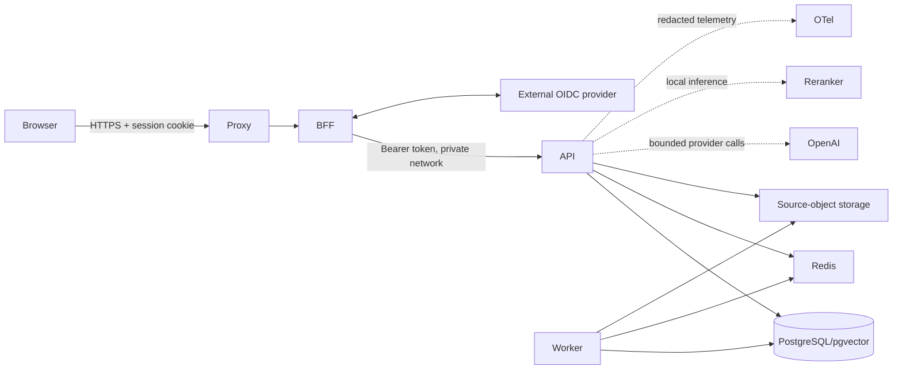

# Architecture and trust boundaries

The browser talks only to the Next.js BFF. The BFF performs OIDC Authorization Code
with PKCE, keeps tokens in an encrypted server-side session, issues Secure,
HttpOnly, SameSite cookies and applies CSRF checks. The TLS reverse proxy is the only
public container. FastAPI, workers, PostgreSQL/pgvector, Redis, object storage and
telemetry remain private services.

OIDC `(issuer, subject)` is immutable identity. PostgreSQL memberships and grants
are authorization truth. Tenant IDs and roles from the browser are never trusted.
Candidate retrieval applies organization and collection scope inside semantic and
keyword queries before limits, ranking or fusion. Application checks remain
mandatory; RLS was not added because the current pooled database role would make a
partial deployment cosmetic rather than defense in depth.

See `THREAT_MODEL.md`, `DEPLOYMENT.md` and
`POST_V1_ENTERPRISE_UPGRADE.md` for controls and tradeoffs.
