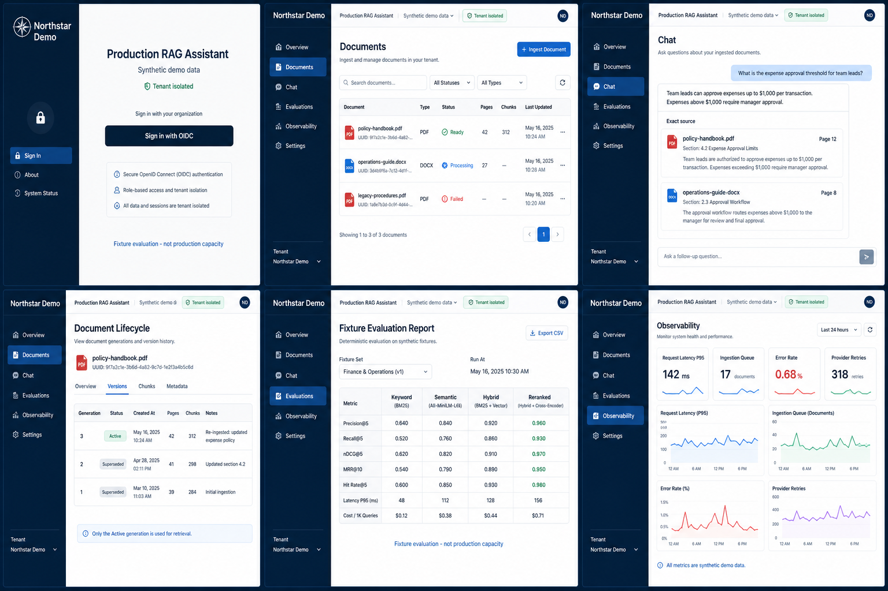

# Portfolio guide and three-minute demo

The product solves a trust problem: teams need answers across internal PDF/DOCX knowledge while inspecting exact evidence without crossing tenant boundaries. It combines authorized retrieval, local reranking, structured generation, validated citations, lifecycle-safe storage, deterministic evaluation and privacy-conscious observability.

This is a curated synthetic mockup, not a live-deployment screenshot. It uses fictional Northstar Demo data and contains no credentials/private content.

## Three-minute script and shot list

0:00–0:20 — business problem and authenticated shell. 0:20–0:40 — synthetic PDF upload and queued/processing/ready states. 0:40–1:05 — keyword versus semantic versus hybrid/reranked fixture results. 1:05–1:30 — grounded answer and exact cited PDF page. 1:30–1:45 — follow-up with renewed authorization. 1:45–2:05 — replace/reindex, active/superseded versions and tombstones. 2:05–2:25 — synthetic tenant denial and OIDC/BFF boundary. 2:25–2:40 — fixture evaluation and observability. 2:40–3:00 — architecture/trust boundaries, production overlay, CI gates and recovery; state that no public URL exists until prerequisites are supplied.

Technology decisions: PostgreSQL/pgvector keeps lexical/vector/relational scope together; Celery/Redis separates bounded ingestion; the storage abstraction preserves originals; FastAPI owns authorization; Next.js is a BFF; plain Python preserves deterministic orchestration. Mohammed Ali will record the walkthrough; no recorded-video or live-link claim is made.
