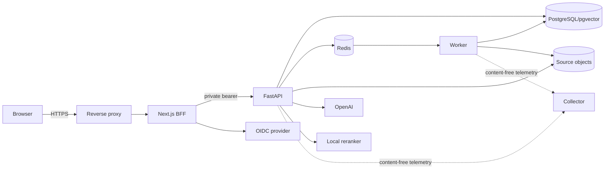

# Concise threat model

Assets are tenant documents, identities/tokens, source objects, embeddings, conversations/citations, secrets, backups, images and telemetry. Internet traffic crosses the TLS proxy into the Next.js BFF; bearer tokens remain server-side. The BFF calls the private API, which re-derives membership. Workers reload opaque job IDs. PostgreSQL, Redis, object storage and observability stay private.

| Boundary | Principal threats | Controls / residual risk |
| --- | --- | --- |
| Browser/BFF and OIDC | token theft, CSRF, redirect/header spoofing | PKCE/state, encrypted Secure/HttpOnly/SameSite cookie, configured HTTPS origin, overwritten forwarding headers; revocation latency remains |
| Public proxy | abuse, smuggling, oversized bodies, XSS/clickjacking | TLS redirect, HSTS/CSP/frame/MIME/referrer/permissions headers, body/time/rate/concurrency limits; CSP retains tested unsafe directives |
| API/worker | tenant bypass, forged citations/jobs, exhaustion | membership joins, opaque jobs, citation validation, parsing/provider bounds, non-root/read-only containers |
| Uploaded documents | parser bombs, malicious PDF/DOCX/instructions | type/size/expanded-size/page/text limits and injection evaluation; parser vulnerabilities remain supply-chain risk |
| PostgreSQL/Redis/storage | credential theft, loss, stale jobs, traversal | scoped secrets/private network, composite tenant keys, checksums, coordinated backup, durable DB jobs; isolation is application-enforced, not RLS |
| OpenAI/local reranker | disclosure, quota exhaustion, compromise | authorized bounded context, content-free telemetry, concurrency/retry limits, pinned reranker revision; provider/cost/model risks remain |
| CI/registry | poisoned PR/action/dependency/image | read-only forks, pinned Actions, no `pull_request_target`, scans/SBOM, immutable tags, protected environment; Docker socket only in trusted hosted image job |
| Backup/observability | theft, telemetry leakage | encryption/off-host guidance, hashes, content-free telemetry, private dashboards; operator/KMS compromise remains |
| Enterprise administration | invitation replay, privilege escalation, stale grants | token hashes, verified issuer/email matching, row locks, last-owner/self-change protections and per-request database authorization |
| Audit/feedback/analytics | private-content leakage, tampering, cross-tenant inference | bounded enums/metadata, tenant-scoped queries, append-only trigger, no raw questions/answers/document text; database superusers remain trusted |

Reachable critical/high findings block release absent evidence-based remediation. Record false positives and accepted risks with artifact, scanner/version, evidence, owner and review date.
